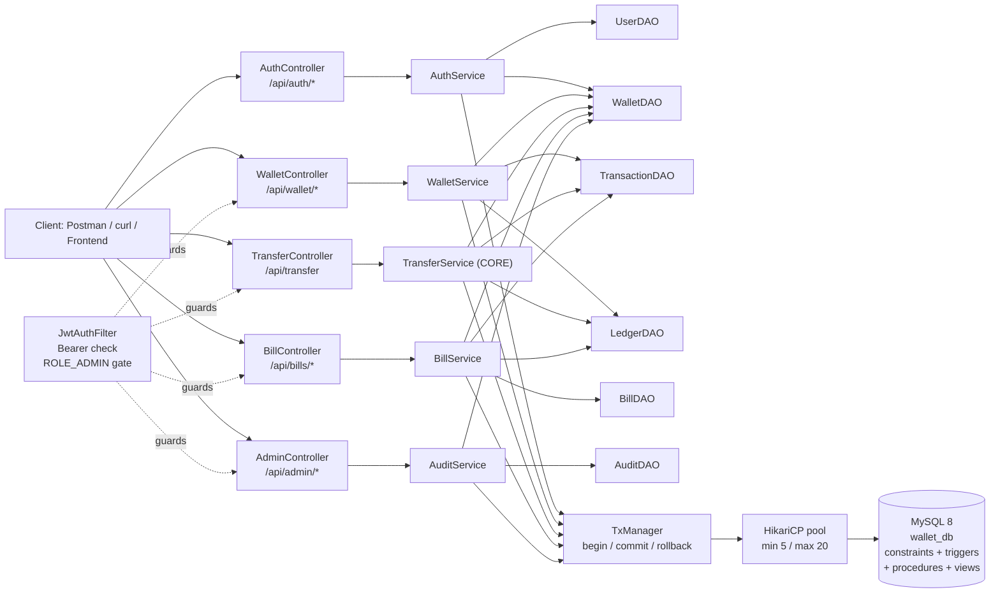
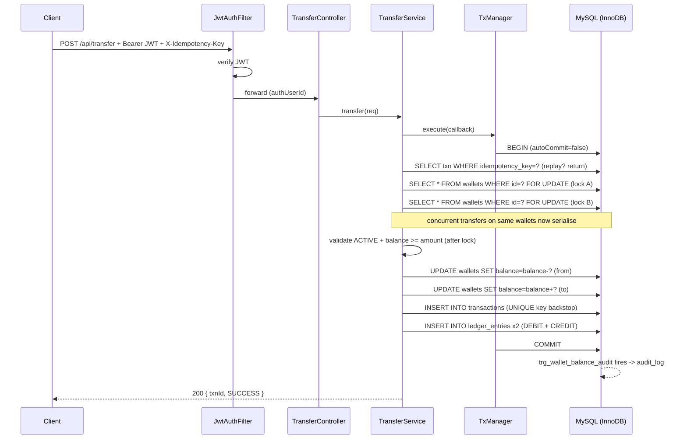

# Architecture — Digital Wallet & Payment System

## Component diagram

Layer rules: Controllers = HTTP only. Services = own transaction boundaries + business rules.
DAOs = raw JDBC PreparedStatements only, no business logic, connection passed in by caller.

## Transfer sequence (with row-level locking)

On any exception: TxManager rolls back, GlobalExceptionHandler maps to
400 / 403 / 404 / 409 JSON.
